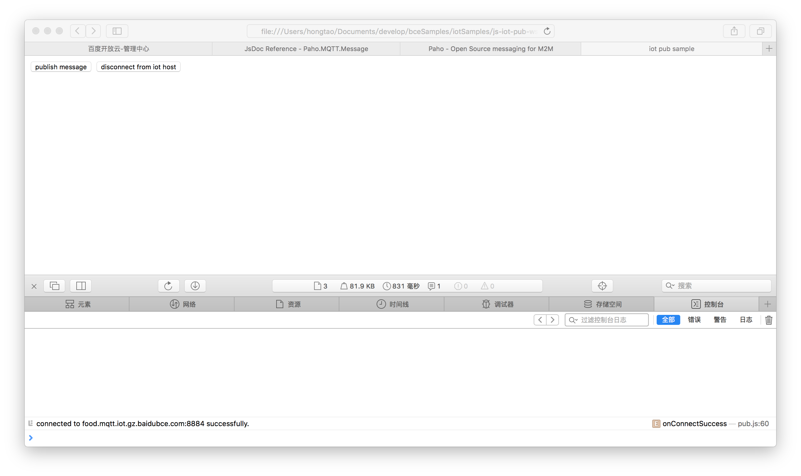

# js-iot-pub-wss

## 用途：

编写Javascripit代码，使用WSS（WebSockets）方式连接到百度IoT服务，然后向指定的主题发布消息。

**注意：需提前开通百度IoT服务，并配置好IoT实例、设备、身份、策略、主题等。**

## 使用方法：

* 第一步：在文件`pub.js`中填写`host`、`username`、`password`、`topic`等信息。
* 第二步：使用浏览器打开`pub.html`（建议打开调试工具的控制台来查看程序的输出）。页面如下图所示：

    
    
* 第三步：点击上图中的按钮`publish message`来发布消息（可配合MQTT.fx等工具来订阅主题并接收消息），或`disconnect from iot`来断开与IoT实例（服务端）的连接。

## 代码简介：

### 第一步：在`pub.js`中引用Paho-mqtt项目的Javascript源码。

```javascript
document.write("<script language=\"javascript\" src=\"https://cdnjs.cloudflare.com/ajax/libs/paho-mqtt/1.0.1/mqttws31.js\"></script>");
```

Paho-mqtt是由Eclipse主导的开源项目。

* 官方网站：[Eclipse Paho-mqtt Javascript](https://www.eclipse.org/paho/clients/js/)
* API文档：[Paho-mqtt Javascript API](http://www.eclipse.org/paho/files/jsdoc/index.html)

### 第二步：创建IoT Client。

```javascript
host = "YOUR_ENDPOINT_NAME.mqtt.iot.gz.baidubce.com";  // 设置IoT实例的连接地址
port = 8884;

clientId = String(Math.random()).substring(2);
iotClient = new Paho.MQTT.Client(host, port, clientId);
```

### 第三步：连接到IoT实例（服务端）。

```javascript
username = "YOUR_ENDPOINT_NAME/YOUR_THING_NAME";  // 设置用户名（设备全名）
password = "身份对应的密钥";  // 设置密码（设备身份所对应的密钥）

connectOptions = {
    invocationContext: {
        host: host,
        port: port
    },

    userName: username,
    password: password,

    timeout: 30,
    keepAliveInterval: 60,
    cleanSession: true,
    useSSL: true,

    onSuccess: onConnectSuccess,
    onFailure: onConnectFailure
};
iotClient.connect(connectOptions);
```

### 第四步：向某个主题发布消息。

```javascript
topic = "YOUR_TOPIC";  // 设置主题（用来发布消息）
payload = String(Math.random());
message = new Paho.MQTT.Message(payload);
message.destinationName = topic;

iotClient.send(message);
```

### 第五步：与IoT实例（服务端）断开连接。

```javascript
iotClient.disconnect();
```